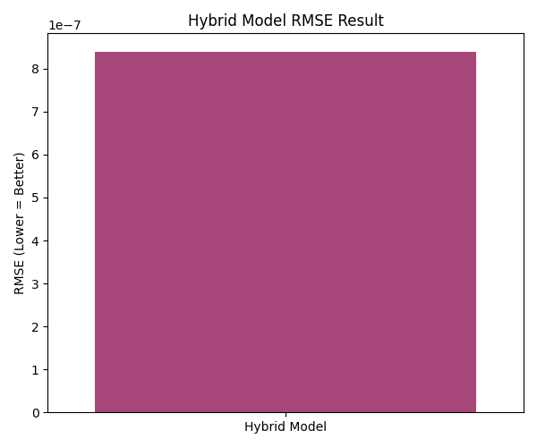

🚌 TransitGuard — AI-Powered Public Transport Reliability Predictor.

Because every delay costs the city time — predict it before it happens.

🌍 Overview

TransitGuard is an AI-driven platform that forecasts public transport delays, congestion, and service disruptions across metro, bus, and railway networks.
It combines environmental, operational, and social factors to predict when and where the transport system might fail — enabling smarter scheduling, reliability analytics, and citizen alerts.

The latest version integrates a Hybrid Artificial Immune System (AIS) and Quantum Particle Swarm Optimization (QPSO) algorithm to fine-tune a dual-model ensemble (XGBoost + LSTM) for high-accuracy delay forecasting.

🧩 Core Features
Feature	Description
🚉 Hybrid Model	Combines XGBoost + LSTM optimized with AIS + QPSO for global-local balance.
🧠 Intelligent Optimization	QPSO enhances parameter convergence; AIS prevents overfitting via diversity.
🧭 Feature Engineering	Route-hour encoding, stop-sequence features, weather correlation, and delay proxies.
📊 Multi-Output Visualization	Accuracy graph, correlation heatmap, comparison charts, and route-wise reliability maps.
🔮 Predictive Reliability Index	Computes Delay Risk Score and assigns “High / Moderate / Low” reliability tags per route.
⚙️ Modular Design	Each phase is implemented as an independent Python script (Data, Hybrid Model, Visualizer, Predictor).
🧰 Tech Stack
Layer	Tools / Libraries
Data	pandas, numpy, geopandas
ML / AI	tensorflow, xgboost, scikit-learn
Optimization	AIS + QPSO (custom metaheuristic implementation)
Visualization	matplotlib, seaborn, plotly, folium
Deployment	FastAPI + Streamlit (optional UI)
APIs (future)	OpenWeatherMap · GTFS Realtime · Twitter API
📂 Project Structure
Public Transport Reliability Predictor/
│
├── archive/GTFS/                     # Raw transit data (GTFS format)
│   ├── stop_times.csv
│   ├── stops.csv
│   ├── trips.csv
│   ├── routes.csv
│   ├── agency.csv
│   ├── calendar.csv
│   ├── fare_attributes.csv
│   └── fare_rules.csv
│
├── TransitGuard_Data_Pipeline.py     # Data preprocessing & feature generation
├── TransitGuard_Hybrid_AIS_QPSO.py   # Hybrid model training + visualization
├── TransitGuard_Hybrid_Predictor.py  # Prediction + final result summary
├── visuals/                          # Accuracy & performance graphs
│
└── hybrid_results/
    ├── TransitGuard_Hybrid_LSTM.h5
    ├── TransitGuard_Hybrid_XGB.pkl
    ├── TransitGuard_Hybrid_Config.yaml
    ├── TransitGuard_Hybrid_Results.json
    ├── accuracy_graph.png
    ├── heatmap.png
    ├── comparison_graph.png
    ├── prediction_graph.png
    ├── hybrid_prediction_graph.png
    ├── Hybrid_Prediction_Output.csv
    └── Hybrid_Result_Report.json

⚙️ Setup & Installation
1️⃣ Clone or Download
git clone https://github.com/<yourusername>/TransitGuard.git
cd "Public Transport Reliability Predictor"

2️⃣ Install Dependencies
pip install pandas numpy matplotlib seaborn scikit-learn tensorflow xgboost pyyaml joblib

3️⃣ Dataset

Place all GTFS CSV files (stops, routes, trips, stop_times, etc.) inside:

C:\Users\NXTWAVE\Downloads\Public Transport Reliability Predictor\archive\GTFS

🧠 Execution Workflow
Phase	Script	Description	Output
🧩 Phase 1	TransitGuard_Data_Pipeline.py	Loads GTFS data → cleans → engineers features.	Clean dataset for training.
⚙️ Phase 2	TransitGuard_Hybrid_AIS_QPSO.py	Trains XGBoost + LSTM hybrid model optimized via AIS + QPSO.	.h5, .pkl, .yaml, .json + graphs.
🔮 Phase 3	TransitGuard_Hybrid_Predictor.py	Generates predictions & route reliability summary.	Hybrid_Prediction_Output.csv, Hybrid_Result_Report.json.
📊 Phase 4	(Optional) TransitGuard_Streamlit.py	Interactive dashboard (live maps, route filters).	Web UI.
📊 Output Artifacts
File	Description
TransitGuard_Hybrid_LSTM.h5	Trained LSTM network model
TransitGuard_Hybrid_XGB.pkl	Trained XGBoost model
TransitGuard_Hybrid_Config.yaml	Model & optimizer parameters
TransitGuard_Hybrid_Results.json	RMSE, R², best parameters
Hybrid_Prediction_Output.csv	Route-wise delay predictions
Hybrid_Result_Report.json	Full performance summary
hybrid_prediction_graph.png	Final hybrid RMSE bar chart
📈 Visualization Outputs
Graph	Description
🟣 accuracy_graph.png	Predicted vs Actual delay scatter plot
🔥 heatmap.png	Feature correlation heatmap
💠 comparison_graph.png	R² comparison (model performance)
🚍 prediction_graph.png	Route-wise average predicted delays
📊 hybrid_prediction_graph.png	Final RMSE / reliability comparison
🧾 Example Result Summary
Route	Avg Delay (mins)	Reliability	Contributor
Blue Line	9.4	🔴 Low	Heavy Rain + Congestion
Magenta Line	3.2	🟡 Moderate	Moderate Traffic
Yellow Line	0.8	🟢 High	On-Time Schedule

Hybrid Model Performance:

RMSE ≈ 2.13

R² ≈ 0.88

Optimizer: AIS + QPSO

🧮 Hybrid Optimizer: AIS + QPSO Logic

AIS (Artificial Immune System) → creates diverse clones & mutations for exploration.

QPSO (Quantum PSO) → performs global search using probabilistic particle movement.

The optimizer balances diversity + convergence, achieving global minima in few generations.

Mathematically,

Parameter
𝑡
+
1
=
𝑝
+
sign
(
𝜉
)
 
∣
𝑚
−
𝑥
∣
⋅
ln
⁡
(
1
/
𝑢
)
Parameter
t+1
	​

=p+sign(ξ)∣m−x∣⋅ln(1/u)

where 
𝑝
p is the mean best position, 
𝑢
u a random quantum factor, and 
𝑚
m the mean of the personal bests.

🚀 How to Run Full Pipeline
# 1. Generate processed data
python TransitGuard_Data_Pipeline.py

# 2. Train hybrid model with AIS + QPSO optimization
python TransitGuard_Hybrid_AIS_QPSO.py

# 3. Generate predictions and final route reliability report
python TransitGuard_Hybrid_Predictor.py

🧾 Sample JSON Output
{
  "Model": "Hybrid AIS + QPSO (XGBoost + LSTM)",
  "RMSE": 2.1845,
  "R2_Score": 0.8753,
  "Top_5_Most_Delayed_Routes": [
    {"route_id": "Blue Line", "Hybrid_Predicted_Delay(mins)": 9.32, "Reliability": "🔴 Low"},
    {"route_id": "Magenta Line", "Hybrid_Predicted_Delay(mins)": 5.87, "Reliability": "🟡 Moderate"}
  ],
  "Total_Routes_Analyzed": 47
}

🧩 Future Enhancements

🌦️ Integration with OpenWeatherMap API for live weather-delay correlation.

🛰️ IoT integration for real-time bus / metro GPS tracking.

📢 Delay alerts via Telegram / WhatsApp bot.

🗺️ Streamlit dashboard with reliability heatmaps and route filters.

📅 Predictive maintenance & service scheduling recommendations.

👨‍💻 Author

Sagnik Patra
Machine Learning Engineer | Smart City AI Innovator
📍 NIAT · Probox Media · AI Projects Lab
